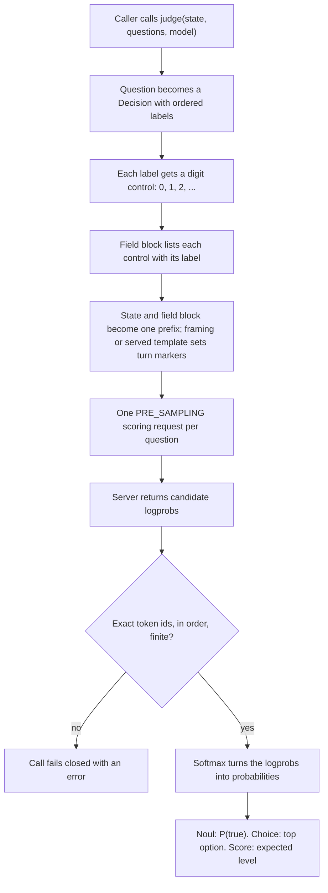

# How typevet works with Gemma 4

Kind: explanation.

This page is for a platform engineer who has not seen typevet. It explains
what typevet does with Gemma 4, how the llama.cpp and vLLM backends differ,
and what the receipts prove. It links to other pages for setup steps and
architecture detail.

## The problem typevet solves

A model that answers in free text gives the caller a string to parse. The
caller does not know how sure the model was. typevet asks a typed question
and returns a typed answer with a probability.

typevet uses three question types from the judgevet vocabulary:

- **Noul**: a yes or no question. The answer is the probability of `true`.
- **Choice**: pick one label from a list. The answer is the selected label,
  its confidence and a probability for each label.
- **Score**: pick a level on a rubric of two or more levels. The answer is
  the expected level, a confidence and a probability for each level.

A fourth path is schema-bound generation. The caller sends a prompt and a
JSON Schema. typevet returns an object that passes that schema, or it raises
an error. This path has no probability.

The [judgment port](../reference/glossary.md) (`JudgmentPort`) carries the
three question types. The [generation port](../reference/glossary.md)
(`GenerationPort` and `AsyncGenerationPort`) carries schema-bound generation.
See [native typed judgments](native-typed-judgments.md) for the product scope.

## How a typed judgment becomes a score

typevet does not let the model write an answer. It reads the model's
next-token distribution at the answer position, before any sampling. It then
keeps only the tokens that stand for the allowed answers.

The flowchart shows how one typed question goes from `judge()` to a typed
answer.

The steps in the code:

1. `ScoringJudgmentAdapter.judge` in `adapters/outbound/judgment_scoring.py`
   receives the call.
2. `normalize_question` and `judgment_original_labels` in
   `domain/judgment_normalize.py` make the Decision. Noul gives
   `(false, true)`. Choice gives the criteria keys. Score gives `0` to `n-1`.
3. `control_binding_pairs` and `bind_control_candidates` bind the controls.
   The tokenizer must encode each digit as exactly one token id.
4. `render_field_instructions` in `domain/field_instructions.py` writes the
   field block. A Choice line reads `0 → billing: Money`. A Noul or Score line
   reads `Control 0 → false`. The last line asks for exactly one control
   string.
5. `_field_prefix` and `_compose_prefix` make one prefix that ends at the
   answer. An injected framing, such as `ChatContentFraming` for vLLM, composes
   it. Otherwise `adapters/outbound/gemma/scoring_prefix.py` uses the served
   template family.
6. `execute_categorical_decision` in `domain/decision_execute.py` sends the
   request to `CandidateScoringPort.score_candidates`. The llama.cpp and vLLM
   adapters implement it.
7. `validate_result_against_request` in
   `domain/candidate_scoring_validate.py` checks the result.
8. `_softmax` and `_greedy_index` compute the probabilities at temperature 1
   by default.
9. `answer_from_execution` builds the typed answer.

The probabilities are conditional on the listed options. Mass that the model
puts on other tokens does not show in the answer. The #207 study below shows
why that matters.

The [scoring port](../reference/glossary.md) (`CandidateScoringPort`) is the
only part that talks to a server. The steps before and after it are pure
domain code. [Library-first architecture](library-first-architecture.md)
explains the layers.

## How generation with a schema works

Four generation adapters send one chat completion each:
`LlamaCppGenerationAdapter`, `AsyncLlamaCppGenerationAdapter`,
`VllmGenerationAdapter` and `AsyncVllmGenerationAdapter`. All four follow the
same three steps.

1. **Check the schema before the request.** `check_request_schema` checks the
   schema against the JSON Schema Draft 2020-12 meta-schema. A malformed
   schema raises `ValueError`, and no request is sent.
2. **Ask the server to constrain the output.** llama.cpp gets a nested
   `response_format.json_schema`, which it turns into a grammar. vLLM gets
   `structured_outputs: {"json": <schema>}`.
3. **Validate the reply on the client.** `validated_value` parses the content,
   rejects non-finite numbers and runs `jsonschema.validate`. A failure raises
   `SchemaValidationError`.

The client check is not a formality. On one llama.cpp pin, the grammar did not
enforce number bounds or `multipleOf` ([#129](#what-the-receipts-prove)). The
client check is the guard for number bounds. The `multipleOf` call returned
empty content, and the adapter raises `GenerationError` for empty content
before any schema check.

## What is specific to Gemma 4

**Native turn template.** Gemma 4 marks turns with `<|turn>` and `<turn|>`. On
llama.cpp, the judgment session renders one message through `/apply-template`.
It then classifies the served template as native Gemma 4, native Gemma 3,
degraded ChatML or unsupported. The llama.cpp judgment session accepts only a
native Gemma 3 or Gemma 4 family. It also requires a model that declares image
input. typevet then writes the prefix in that
family's turn markers itself, because `/completion` takes raw text. On vLLM,
the server applies the served chat template. typevet sends the prefix as plain
user content.

**Thinking off.** Gemma 4 can start a thinking section before it answers.
typevet reads the score at the first answer token, so no thinking section may
open there. The #207 research found the no-thinking prefill boundary to be
the main driver of off-menu mass. Each backend turns thinking off in a
different way:

- llama.cpp scoring adds the no-thinking prefill `<|channel>thought\n<channel|>`
  after the model turn header. The answer token comes directly after it.
- vLLM scoring and vLLM generation send
  `chat_template_kwargs: {"enable_thinking": false}`.
- llama.cpp generation sends the same `enable_thinking: false` value.

**Digit controls and the one-token limit.** The model answers with a digit,
not with the label text. One next-token read then covers the whole answer.
On the Gemma 4 tokenizer, `"0"` to `"9"` are
single tokens and `"10"` is two. A native question with more than 10 options
therefore fails before any scoring call, with the message
`native Choice supports N options on this tokenizer; got M` (#234). The
rendered digits and the scored token ids come from one function,
`control_binding_pairs`, so they cannot drift apart.

**Image input.** A judgment can take images. Both backends support
image-conditioned scoring. On vLLM, generation can also take images. llama.cpp
generation refuses images before any request. See
[Gemma 4 multimodal judgments](gemma-4-multimodal-judgments.md) for the
detail.

## The two backends side by side

| Aspect | llama.cpp | vLLM |
|---|---|---|
| Use | Local development and small receipts | Hosting and throughput |
| Weights in the receipts | Quantized GGUF files | BF16 `google/gemma-4-31B-it` at one revision |
| Scoring call | `POST /completion` with the raw prefix, `n_predict` 0, `n_probs` 262144 | `POST /v1/chat/completions` with `max_tokens` 1, `logprob_token_ids`, `return_tokens_as_token_ids` |
| Scoring result | `completion_probabilities[0].top_logprobs` | `choices[0].logprobs.content[0].top_logprobs` |
| Turn markers | typevet writes them (native Gemma 4 turn and prefill) | The server applies the chat template |
| Control tokenizer | Router `/tokenize` | Server `/tokenize` with `add_special_tokens` false |
| Generation constraint | `response_format.json_schema`, which becomes a grammar | `structured_outputs` with the JSON Schema |
| Parallel requests | No concurrency setting | `AsyncVllmGenerationAdapter` with a `max_concurrency` limit |
| Candidate limit per call | No adapter limit | At most 128 `logprob_token_ids` |
| Setup page | [Run Gemma 4 on llama.cpp](../how-to/run-gemma4-llamacpp.md) | [Serve typevet on vLLM](../how-to/serve-typevet-on-vllm.md) |

Three ports make the backends interchangeable:

- `CandidateScoringPort` has one method, `score_candidates`.
  `LlamaCppCandidateScoringAdapter` and `VllmCandidateScoringAdapter` both
  implement it. `ScoringJudgmentAdapter` takes either one.
- `GenerationPort` and `AsyncGenerationPort` have one `generate` method. The
  four generation adapters implement them.
- `ModelFramingPort` composes the prefix. The vLLM session injects
  `ChatContentFraming`, which adds no turn markers. The llama.cpp session
  passes the served template family instead.

`TYPEVET_BACKEND` selects `llama_cpp` (the default) or `vllm` for the
composition root. The caller code that calls `judge` or `generate` does not
change.

## What the receipts prove

Each claim below comes from one issue comment. Read the receipt for the full
pin and its limits.

- **llama.cpp CORD smoke** ([#203](https://github.com/Alberto-Codes/typevet/issues/203#issuecomment-5882379255)):
  one live run of the CORD combined arm on llama.cpp build `b11223-4da633776`
  with a native Gemma 4 turn. It passed 5 of 5 checks, and the acceptance
  command exited 0. The sample is 6 to 18 claims per check. It is smoke
  evidence, not calibration.
- **vLLM acceptance** ([#170](https://github.com/Alberto-Codes/typevet/issues/170#issuecomment-5884707915)):
  one run on `vllm/vllm-openai:v0.30.0` with BF16 `google/gemma-4-31B-it` on
  one H100 80 GB. The generation, image scoring and CORD sets passed their
  pre-registered gates. It used 88 model calls. Two sets were record-only:
  reversed label order gave 0 flips, and 4 parallel generation calls gave
  0 errors.
- **llama.cpp grammar enforcement** ([#129](https://github.com/Alberto-Codes/typevet/issues/129#issuecomment-5892208050)):
  one run used build `b11243-fc07d781e` and a Gemma 4 31B QAT Q4_0 GGUF.
  The grammar enforced string `enum`, integer bounds and the JSON object root.
  It did not enforce number bounds or `multipleOf`. typevet's client
  validation catches a number outside its bounds. The `multipleOf` call
  returned empty content, which the adapter raises as `GenerationError`.
- **Off-menu mass fix** ([#207](https://github.com/Alberto-Codes/typevet/issues/207#issuecomment-5897195419)):
  one 6-option Choice prompt put 0.9105 of the next-token mass on the word
  "Control", not on a digit. After Choice options dropped the word "Control",
  the off-menu mass on that prompt was 1.99e-7. The winning label did not
  change. This was one prompt on llama.cpp only.
- **H100 throughput** ([#236](https://github.com/Alberto-Codes/typevet/issues/236)):
  in progress. [Attempt 1](https://github.com/Alberto-Codes/typevet/issues/236#issuecomment-5897655847)
  made no model call. One question had 13 options, and native Choice
  supports 10 on the Gemma 4 tokenizer ([#234](https://github.com/Alberto-Codes/typevet/issues/234)).
  No throughput measurement exists yet.
  [Attempt 2](https://github.com/Alberto-Codes/typevet/issues/236#issuecomment-5897713570)
  on public datasets is planned.

## What is not claimed

- **Other models.** Every receipt uses Gemma 4 31B. No other model is tested.
- **Other quantizations.** Each receipt covers its own weights file. #129
  used a Q4_0 file. #203 ran the local alias `gemma-4-31b-kv9-q4km-mm` and did
  not record its file type. That alias loads a Q2_K file today (#233). vLLM
  used BF16. The #170
  receipt does not attribute any difference to the backend, because the
  weights differ.
- **Calibration quality.** A valid structure and a valid probability do not
  prove accuracy or calibration. The receipts are small samples. See
  [native typed judgments](native-typed-judgments.md#limitations).

## Related pages

- [Native typed judgments](native-typed-judgments.md)
- [Library-first architecture](library-first-architecture.md)
- [Gemma 4 multimodal judgments](gemma-4-multimodal-judgments.md)
- [Run Gemma 4 on llama.cpp](../how-to/run-gemma4-llamacpp.md)
- [Serve typevet on vLLM](../how-to/serve-typevet-on-vllm.md)
- [Glossary](../reference/glossary.md)
