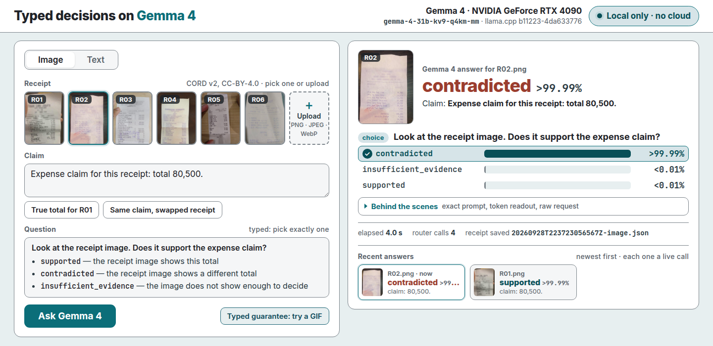
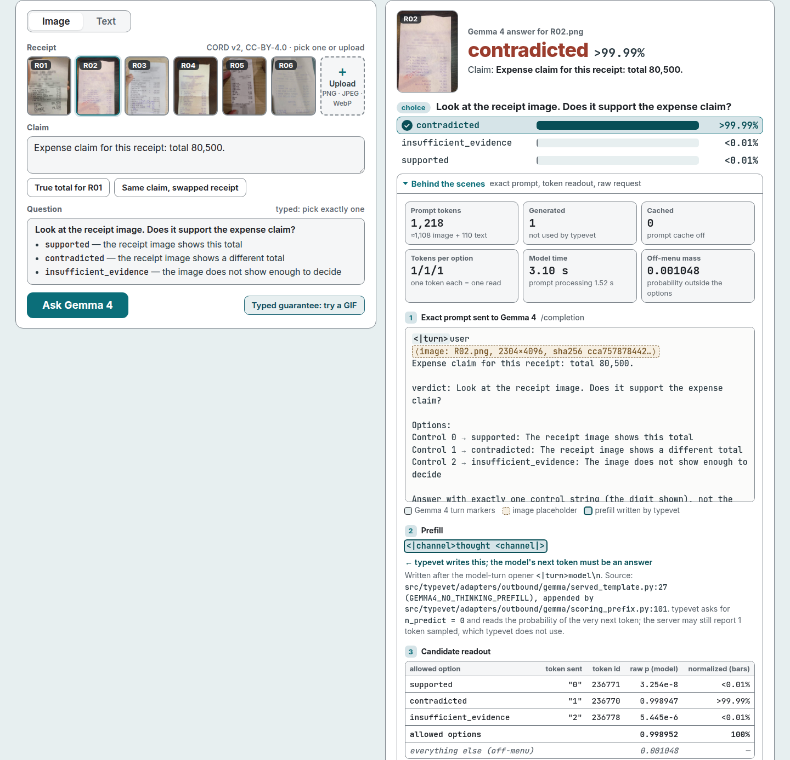
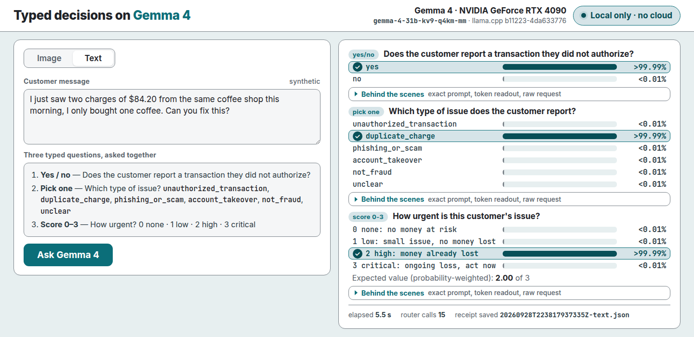
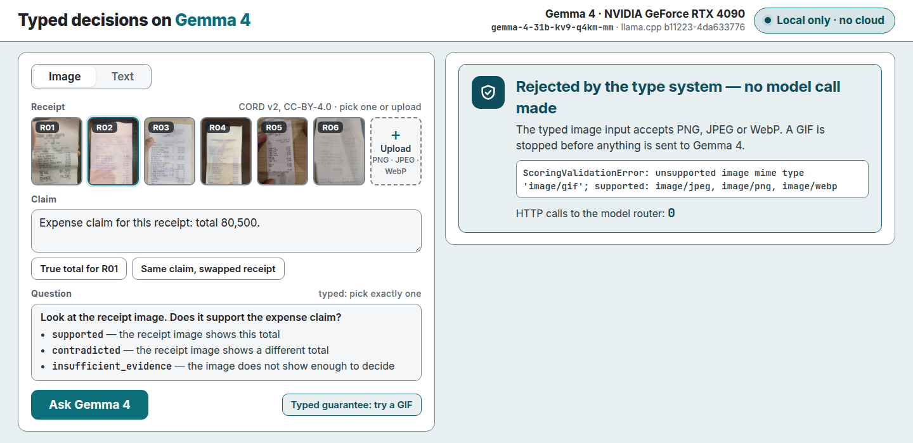

# Stand up the live demo

Kind: how-to.

This page tells you how to start the live demo and show it. The demo asks typed questions to Gemma 4 on a local llama.cpp router. The files are in `examples/live-demo/`. The [live demo reference](https://github.com/Alberto-Codes/typevet/blob/main/examples/live-demo/README.md) lists each file.

## Prerequisites

1. Start a llama.cpp router on `127.0.0.1:8090`. [Run Gemma 4 on llama.cpp](run-gemma4-llamacpp.md) gives the steps.
2. Serve a Gemma 4 model that accepts images. The default model id is `gemma-4-31b-kv9-q4km-mm`.
3. Sync the repository checkout with `uv sync`. The gallery reads six CORD receipts from `tests/fixtures/cord/expense_smoke/`.
4. Set the `TYPEVET_LLAMA__*` variables if your router is different from the defaults.

| Name | Default | Use |
|---|---|---|
| `TYPEVET_LLAMA__BASE_URL` | `http://127.0.0.1:8090` | llama.cpp router URL. |
| `TYPEVET_LLAMA__MULTIMODAL_MODEL` | `gemma-4-31b-kv9-q4km-mm` | Router model id. The model must accept images. |
| `TYPEVET_LLAMA__TIMEOUT` | `900` | Router timeout in seconds. |

The web page uses port `8765`. Set `LIVE_UI_PORT` to use a different port. The server binds `127.0.0.1` only.

## Start the server

1. Run this command from the repository root:

   ```bash
   uv run python examples/live-demo/server.py
   ```

2. Wait for the `ready` line. The first start loads the model in approximately 30 to 60 seconds.
3. Open `http://127.0.0.1:8765/` in a browser.
4. Press Ctrl+Shift+R to load the current page.

## Show the demo

1. Click "True total for R01". Then click "Ask Gemma 4". The answer is "supported".
2. Click "Same claim, swapped receipt". Then click "Ask Gemma 4". The answer is "contradicted".

   

   The screenshots replay saved receipts from the 2026-09-28 run through a stub server, with no live router.

3. Upload `examples/live-demo/insufficient-R01-blurred.png`. Then click "Ask Gemma 4". The answer is "insufficient evidence".
4. Open the "Behind the scenes" panel under the answer.

   

5. Select the Text tab. Then click "Ask Gemma 4". Three typed answers show: yes or no, pick one, and a score.

   

6. Select the Image tab. Then click "Typed guarantee: try a GIF". typevet refuses the GIF before a model call.

   

## Find the receipts

Each judgment writes one JSON receipt under `typevet-receipts/` in the repository root. Git ignores that directory. A receipt holds the request, the answers, the model, the llama.cpp build, the GPU and the timing.

## Record the run of show

1. Start the server.
2. Run the recorder from the repository root:

   ```bash
   node examples/live-demo/record.mjs
   ```

3. Add `--dry` to check the overlay and the capture without model calls.

The recorder reads two variables:

| Name | Default | Use |
|---|---|---|
| `TYPEVET_DEMO_UPLOAD` | `insufficient-R01-blurred.png` beside `record.mjs` | Image for the upload step. |
| `TYPEVET_DEMO_CHROME` | `google-chrome` on `PATH` | Chrome binary. |

## Known limits

- Do not show a receipt with a cropped total. On that image, Gemma 4 answered "contradicted", not "insufficient evidence". Issue [#189](https://github.com/Alberto-Codes/typevet/issues/189) specifies evaluation data with cropped required fields.
- On the six-option fraud question, the panel shows off-menu mass. Issue [#207](https://github.com/Alberto-Codes/typevet/issues/207) researches large off-menu mass on multi-option Choice questions.
