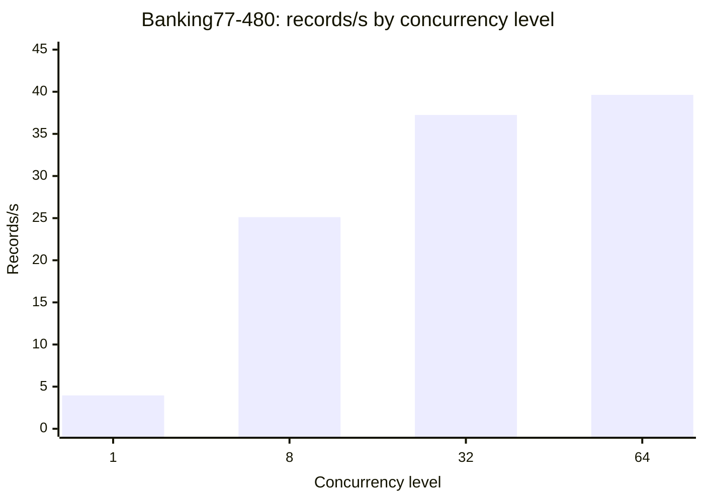

# Performance on one H100

Kind: reference.

This page lists the typed-judgment throughput that typevet measured on vLLM.
The source of every number is the
[#236 attempt-2 live receipt](https://github.com/Alberto-Codes/typevet/issues/236#issuecomment-5898660690).
The pod cost comes from the
[#236 supervisor pod record](https://github.com/Alberto-Codes/typevet/issues/236#issuecomment-5898685257).
The data is from one run on one pod with one pin.

## Pins

| Item | Value |
|---|---|
| Server image | `vllm/vllm-openai:v0.30.0` (`/version` returns `0.30.0`) |
| Model | `google/gemma-4-31B-it`, served as `gemma-4-31b-it` |
| Model revision | `842da3794eaa0b77d5f08bae87a17459d91ff475` (short `842da37`), per the contract |
| Weights | BF16, no quantization |
| GPU | One H100 80GB HBM3 SXM, RunPod secure cloud, data center US-MO-1 |
| Server flags | `--max-model-len 8192 --gpu-memory-utilization 0.95 --max-num-seqs 64 --enable-prefix-caching --logprobs-mode raw_logprobs --served-model-name gemma-4-31b-it` |
| API key | Required |
| typevet revision | `a0cc4b9` |
| Client | The operator machine, through the RunPod proxy, `User-Agent: curl/8.9.1` |
| Harness | `tests/live/test_public_throughput_live.py` |
| Run date | 2026-09-29 |

`/v1/models` does not show a model revision.
The revision comes from the pre-registered contract.

## Method

The harness sends one `judge` call per record through the sync judgment port.
A thread pool sets the number of records in flight.
This page calls that number the concurrency level.
Each question in a record uses one scoring call.

| Measure | Definition |
|---|---|
| Wall-clock | Last record end minus first record start, on the client clock |
| Records/s | Answered records divided by wall-clock seconds |
| Scoring calls/s | Scoring calls divided by wall-clock seconds |
| Client latency | Seconds per sent record, on the client, proxy included |
| Server e2e | vLLM `/metrics` request latency histogram, per scoring call |
| Errors | Records without an answer |

Server percentiles are histogram bucket upper bounds.
The smallest bucket edge is 0.3 s.
Thus "≤0.3" means 0.3 s or less, with no more detail.

## Banking77 balanced, 480 records

The set holds all 240 fraud rows and 240 other rows of the Banking77 test split.
Each record asks the `reports_unauthorized` Noul and the `fraud_type` Choice with 6 options.
Each record uses two scoring calls.
The mean prompt is 253.7 tokens per record, and the longest is 337 tokens.

| Level | Records | Wall-clock (s) | Records/s | Scoring calls/s | Client p50 / p95 / p99 (s) | Server e2e p95 (s, bucket bound) | Errors |
|---|---|---|---|---|---|---|---|
| 1 | 480 | 121.36 | 3.96 | 7.91 | 0.243 / 0.295 / 0.396 | ≤0.3 | 0 |
| 8 | 480 | 19.11 | 25.12 | 50.24 | 0.309 / 0.376 / 0.538 | ≤0.3 | 0 |
| 32 | 480 | 12.89 | 37.25 | 74.50 | 0.825 / 1.014 / 1.310 | ≤0.5 | 0 |
| 64 | 480 | 12.11 | 39.63 | 79.26 | 1.588 / 1.883 / 2.028 | ≤1.0 | 0 |

Level 64 gives 10.0 times the records/s of level 1.
From level 32 to level 64, records/s increases by 6%.
Over the same step, the client p50 latency is about two times larger.
The four levels together took 167.0 s.

## DIFrauD SMS, 500 records, level 64

The set holds 500 rows of the DIFrauD SMS test split, drawn with seed 0.
Each record asks the `is_scam` Noul and uses one scoring call.
The mean prompt is 89.0 tokens per record, and the longest is 150 tokens.

| Level | Records | Wall-clock (s) | Records/s | Scoring calls/s | Client p50 / p95 / p99 (s) | Server e2e p95 (s, bucket bound) | Errors |
|---|---|---|---|---|---|---|---|
| 64 | 500 | 4.88 | 102.46 | 102.46 | 0.592 / 0.880 / 1.122 | ≤0.8 | 0 |

## Calibration against finvet

The contract compares the expected calibration error (ECE) of each set with a finvet Jev baseline.
ECE uses 10 equal-width probability bins.
The pass threshold adds 0.03 to the finvet value.

| Set | Answered | ECE | finvet Jev ECE | Threshold | Base rate (typevet / finvet) | Result |
|---|---|---|---|---|---|---|
| Banking77-480 | 480 of 480 at each level | 0.0892 to 0.0905 | 0.17 | 0.20 | 0.500 / 0.50 | Pass |
| DIFrauD SMS-500 | 500 of 500 | 0.1578 | 0.07 | 0.10 | 0.184 / 0.196 | Fail, no parity |

The Banking77-480 ECE per level is 0.0902 (1), 0.0892 (8), 0.0905 (32) and 0.0905 (64).

DIFrauD fails parity because the model is overconfident on "scam".
166 records have a scam probability of 0.9 or more.
Only 55.4% of those 166 records are scam.
About 74 records that are not scam get a high "scam" probability.

The typevet rows differ from the finvet rows.
finvet samples rows differently from the typevet hash seed.
The finvet baselines have two decimals and came from the Jev service `jev-1.13.0`.
The Jev backend and hardware are unknown.

## Cold start and cost

| Item | Value |
|---|---|
| Pod created | 20:41:39Z |
| `/v1/models` ready | 20:48:25Z |
| Cold start | 6 min 46 s |
| Run | 20:49:00Z to 20:51:54Z |
| Pod price | $3.49 per hour |
| Pod cost, creation to deletion | About $0.75, from creation at 20:41:39Z to deletion at 20:54:27Z |
| Compute cost per 1,000 Banking77 records at level 64 | About $0.024 |

The cost per 1,000 records is arithmetic, not a measured value.
It is 1,000 records at 39.63 records/s, priced at $3.49 per hour.
It excludes cold start, idle time and the proxy.

## Not measured

- **Full Banking77 test split, 3,080 records.** The runner stopped before the first scoring call.
  The harness shares one tokenizer-call cap of 256 across the whole run.
  Only 144 calls were left for 3,080 new texts, so the runner stopped before the first scoring call.
  This is a harness limit, not a limit of typevet or vLLM.
  No throughput, latency or ECE exists for this set.
- **The finvet collections workload.** One question has 13 options.
  Native Choice supports 10 options on the Gemma 4 tokenizer.
  This run did not measure that workload.
- **GPU memory.** The vLLM `/metrics` endpoint does not show it.

## Limits

- Public datasets only. No partner data was measured.
- The data is from one run, one pod and one model pin.
- The texts are short public texts of 89 to 254 mean prompt tokens per record.
  The throughput does not transfer to longer prompts.
- Client latency includes the RunPod proxy from the operator machine to US-MO-1.
- Server percentiles are histogram bucket upper bounds. Below 0.3 s they give no detail.
- The page makes no claim about other GPUs, models, precisions or vLLM versions.
- Calibration here is ECE on two sets. It is not a general quality claim.

## Dataset attribution

- Banking77 by PolyAI (Casanueva et al., 2020), licensed under CC BY 4.0.
- DIFrauD (`difraud/difraud` on Hugging Face), licensed under MIT.

No record text is in the receipt or on this page.

## Related pages

- [Serve Gemma 4 31B on a rented H100](../how-to/serve-gemma-4-31b-on-a-rented-h100.md)
- [Serve typevet on vLLM](../how-to/serve-typevet-on-vllm.md)
- [Typed-judgment release support matrix](typed-judgment-release-support-matrix.md)
- [Banking77 proxy and metrics](banking77-proxy-and-metrics.md)
- [DIFrauD loader](eval-difraud-loader.md)
